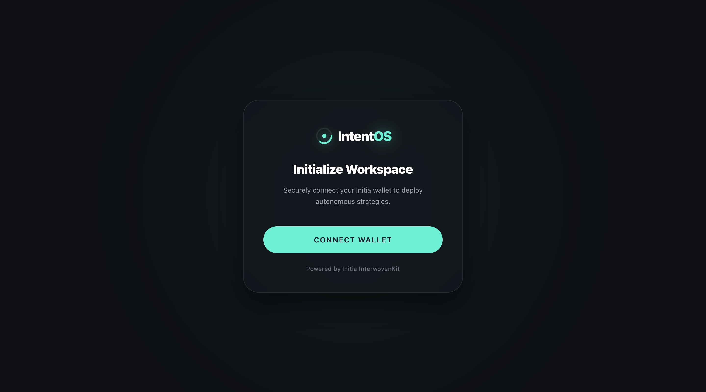
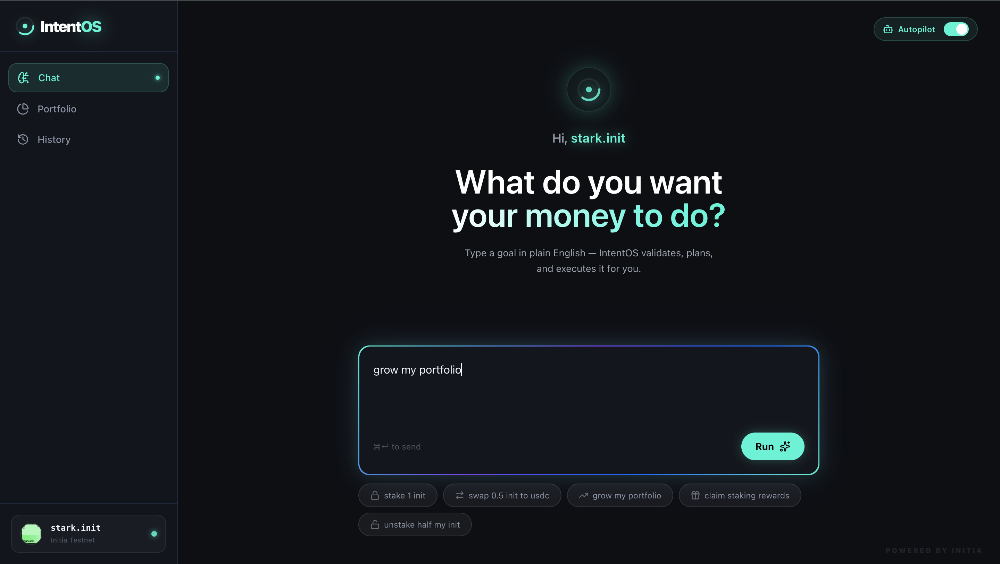
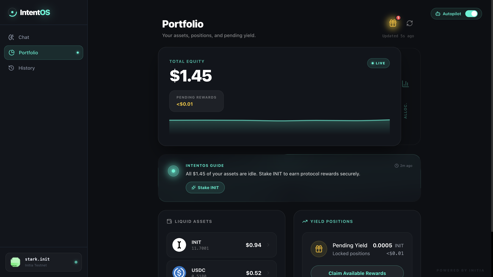

# IntentOS — AI Financial Operating System for DeFi

> **IntentOS allows users to execute complex DeFi strategies on Initia simply by describing what they want their money to do.**

[](https://initia.xyz)
[](https://github.com/initia-labs/interwovenkit)
[](LICENSE)

---

## 🧠 TL;DR

IntentOS is an AI-powered financial operating system built on Initia.

Users describe financial goals in natural language (e.g., `"stake 1 INIT"` or `"grow my portfolio"`), and IntentOS converts those goals into executable on-chain DeFi strategies.

```
Intent → Strategy → Simulation → Execution → Portfolio Update
```

All transactions execute on Initia testnet using Move smart contracts and InterwovenKit wallet integration.

> Unlike traditional DeFi dashboards, IntentOS treats DeFi as an operating system — translating human intent into automated on-chain financial strategies.

---

## 🎥 Demo

| | |
|---|---|
| **Live Demo** | [https://app.intentos.xyz](https://app.intentos.xyz) |
| **Demo Video** | [https://youtu.be/tVpuoN79Lgs](https://youtu.be/tVpuoN79Lgs) |
| **GitHub** | [https://github.com/mr-574rk/intentos](https://github.com/mr-574rk/intentos) |
| **Screenshots** | See below ↓ |

---

## 📸 Screenshots

### Onboarding — Connect Wallet


### Intent Interface — Natural Language DeFi


### Portfolio Dashboard — Live Equity & Positions


---

## 🔗 On-Chain Execution Proof

All strategies execute as real on-chain transactions on the Initia testnet (`initiation-2`).

**Example Stake TX:**
https://scan.testnet.initia.xyz/initiation-2/txs/A208BFF36B104E7306F3EA9CF0BEE2671C9DC88935E8EAA731E005974B626D44

**Contract Deployment:**
https://scan.testnet.initia.xyz/initiation-2/accounts/0x3dd7b889be628c573c8a46b0f7657ae8483ebec3

---

## The Problem

DeFi today is powerful but still extremely difficult to use — even for people who understand it.

To earn yield on a single token today, a user might need to:
1. Find the right protocol
2. Approve token spending
3. Execute a swap
4. Navigate to a staking interface
5. Delegate tokens manually
6. Return later to claim rewards
7. Figure out what to do with those rewards

Each step requires understanding a different UI, a different wallet confirmation, and different risk parameters.

**The result:** Most people never get past step one. Billions in assets sit idle because the interface is too complex.

---

## ⚡ Initia-Native Features

IntentOS integrates deeply with the Initia ecosystem:

- **InterwovenKit Wallet Integration** — native Initia wallet UX and Cosmos transaction signing via `@initia/interwovenkit-react`
- **Move Smart Contracts** — `StrategyExecutor` and adapter modules written in Initia Move, deployed on `initiation-2`
- **`.init` Username Support** — send assets to human-readable identities (e.g. `@alice.init`) resolved natively
- **Native Staking Integration** — direct interaction with Cosmos staking modules (`MsgDelegate`, `MsgUndelegate`, `MsgWithdrawDelegatorReward`)
- **Native DEX Routing** — `dex_adapter.move` routes swaps through Initia's built-in AMM without third-party bridges
- **Initia Testnet Execution** — all strategies executed on-chain (`initiation-2`) via `https://rpc.testnet.initia.xyz`
- **LCD Balance Fetching** — live portfolio data pulled from `https://lcd.testnet.initia.xyz` in real-time

---

## The Solution

IntentOS is a conversational DeFi operating system. You describe your financial goal in plain English. IntentOS handles everything else.

```
User: "Stake 1 INIT"
IntentOS: Validates balance → Builds strategy → Executes on Initia testnet
```

**Example intents the system understands today:**
- `"stake 1 init"` — delegates tokens to a validator
- `"swap 0.5 init to usdc"` — routes through Initia's DEX
- `"claim staking rewards"` — collects pending rewards
- `"grow my portfolio"` — AI generates a diversified yield strategy
- `"send 10 init to @alice.init"` — transfer to a `.init` username
- `"unstake half my init"` — partial undelegation

The system maps plain language to real on-chain transactions without requiring users to understand the underlying mechanics.

---

## 🎯 Demo Flow (For Judges)

Follow these steps to test the full system end-to-end:

**Step 1 — Land on the app**
> Visit the landing page. Click **"Get Started"** → routed to the onboarding gateway.

**Step 2 — Connect your wallet**
> Click **"Connect Wallet"** on the onboarding screen. InterwovenKit opens, allowing connection via Initia Wallet or any compatible Cosmos wallet.

**Step 3 — Type a financial intent**
> On the Intent page, type: `"stake 0.5 init"`
> IntentOS validates your balance, classifies the intent, and generates an execution strategy.

**Step 4 — Review the Agent Timeline**
> Watch the AI Agent Timeline animate through:
> `Intent Parsed → Strategy Built → Simulation Complete → Ready to Execute`

**Step 5 — Confirm and execute**
> Click **"Execute Strategy"**. Your wallet prompts for a single signature. The transaction is sent to the Initia testnet.

**Step 6 — View the Success Modal**
> A premium success card appears with your transaction hash and a link to the Initia block explorer.

**Step 7 — Check your portfolio**
> Navigate to **Portfolio**. Your staked balance now appears under "Staked" alongside your updated total equity.

---

## ✨ Key Features

| Feature | Description |
|---|---|
| **Natural Language DeFi** | Chat interface understands plain-English financial commands |
| **AI Strategy Generator** | Maps goals to structured multi-step DeFi strategies |
| **Pre-flight Validation** | Checks real wallet balance before generating strategies — no fake transactions |
| **Agent Timeline UX** | Animated pipeline visualizes each AI decision step: Parse → Build → Simulate → Execute |
| **On-chain Execution** | Real transactions signed and submitted to Initia testnet |
| **Portfolio Dashboard** | Live equity, staked positions, pending rewards, and asset allocation |
| **Rewards System** | Claim pending staking rewards with a single click |
| **Autopilot Mode** | Enable/disable automated portfolio management strategies |
| **Intent History** | Full log of every submitted intent and execution result |
| **Strategy Simulation** | Risk and yield simulation before any real funds move |

---

## 🏗️ Architecture

IntentOS has three main layers that work together in a clear pipeline.

```
┌─────────────────────────────────────────────────────────────┐
│                      USER INTERFACE                          │
│        Next.js + Tailwind CSS + Framer Motion               │
│   Landing → Onboarding → Intent Chat → Portfolio Dashboard   │
└──────────────────────────┬──────────────────────────────────┘
                           │ HTTP / REST
┌──────────────────────────▼──────────────────────────────────┐
│                      BACKEND API                             │
│               Node.js + Express (Port 4000)                  │
│                                                              │
│  /api/execute/intent  — parse + classify intent              │
│  /api/execute/run     — build + submit transaction           │
│  /api/portfolio       — fetch live wallet data via LCD       │
│  /api/simulate        — risk/yield projection                │
│  /api/strategy        — retrieve generated strategies        │
│  /api/history         — intent execution history             │
│  /api/agent-timeline  — stream agent thought process         │
└──────────────────────────┬──────────────────────────────────┘
                           │ Cosmos LCD / RPC
┌──────────────────────────▼──────────────────────────────────┐
│                   INITIA TESTNET                             │
│              Chain ID: initiation-2                          │
│                                                              │
│  StrategyExecutor.move    — orchestrates strategy execution  │
│  PermissionManager.move   — session key / delegation model   │
│  dex_adapter.move         — routes swap transactions         │
│  staking_adapter.move     — handles stake/unstake/claim      │
│  bank_adapter.move        — manages native INIT transfers    │
│  lending_adapter.move     — interfaces with lending pools    │
└─────────────────────────────────────────────────────────────┘
```

**Request flow for a typical intent:**
```
User types "stake 1 init"
     ↓
Pre-flight check (is balance sufficient?)
     ↓
Intent router classifies action type
     ↓
Strategy generator builds execution plan
     ↓
Transaction builder constructs Cosmos Msg payload
     ↓
InterwovenKit signs transaction
     ↓
Submitted to Initia testnet RPC
     ↓
Portfolio refreshes with new state
```

---

## ⛓️ Initia Integration

IntentOS is built specifically for the Initia ecosystem — not a generic EVM tool ported over.

| Integration Point | Implementation |
|---|---|
| **Wallet Connection** | `@initia/interwovenkit-react` — native Initia wallet UX with Cosmos signing |
| **Username Resolution** | `.init` usernames resolved and displayed throughout the interface |
| **Testnet Transactions** | All executions target `initiation-2` via `https://rpc.testnet.initia.xyz` |
| **Move Smart Contracts** | Custom Move modules deployed on Initia for strategy execution |
| **DEX Integration** | `dex_adapter.move` routes through Initia's native DEX |
| **Native Staking** | `staking_adapter.move` interacts with Initia's Cosmos staking module |
| **LCD Balance Fetch** | Portfolio data pulled from `https://lcd.testnet.initia.xyz` in real-time |
| **Batch Execution** | Multiple `MsgExecute` payloads can be bundled in a single transaction |

**Why Initia?**

Initia's interwoven architecture — combining Move smart contracts with Cosmos SDK modules — makes it uniquely suited for an AI operating system. The native DEX, staking primitives, and Identity layer (`.init` usernames) give IntentOS direct access to everything needed to execute complex financial strategies without relying on third-party bridges or wrapped assets.

---

## 📜 Smart Contracts

All contracts are written in **Move** and located in `/contracts/`.

| Contract | Purpose |
|---|---|
| `StrategyExecutor.move` | Central orchestrator — receives strategy payloads and dispatches execution across adapters |
| `PermissionManager.move` | Manages session keys and delegation permissions for Autopilot mode |
| `adapters/dex_adapter.move` | Handles all DEX swap routing through Initia's native AMM |
| `adapters/staking_adapter.move` | Wraps Cosmos staking `MsgDelegate`, `MsgUndelegate`, `MsgWithdrawDelegatorReward` |
| `adapters/bank_adapter.move` | Handles native INIT token transfers (`MsgSend`) |
| `adapters/lending_adapter.move` | Interfaces with Initia lending pool protocols |

**Session Key Security Model:**
`PermissionManager.move` implements scoped permission delegation. Users can grant limited signing authority to the Autopilot agent for specific actions (e.g., "only claim rewards, never move principal") without exposing their primary private key.

---

## 💬 Supported Intents

Intents are parsed through a classification layer in the backend before being routed to the appropriate strategy generator.

**Staking**
- `stake [amount] init` — delegate INIT to validator
- `unstake [amount] init` / `unstake half my init` — undelegate
- `claim staking rewards` / `collect rewards` — withdraw pending yield

**Swaps**
- `swap [amount] init to usdc`
- `swap [amount] usdc to init`

**Transfers**
- `send [amount] init to [address or .init username]`
- `transfer [amount] to @alice.init`

**AI Strategy Goals** (multi-step)
- `grow my portfolio` — AI creates a diversified stake + yield strategy
- `earn passive income` — generates a yield-optimized plan
- `spread my funds` — diversifies allocation across protocols

**System Commands**
- `help` — shows available commands
- `enable autopilot` / `disable autopilot`
- `receive init` — shows your wallet address for deposits

---

## 📊 Portfolio Intelligence

The Portfolio page (`/app/portfolio`) provides a live dashboard of your entire DeFi position.

**Dynamic Wallet Header ("Wallet Stack"):**
- **Total Equity Card** — USD value of all assets + sparkline history chart
- **Portfolio Allocation Card** — visual breakdown of INIT, USDC, staked positions

**Asset Tracking:**
- Raw token balances (INIT, USDC, and other IBC assets)
- Staked/delegated positions with validator info
- Pending reward amounts (USD value)
- Stablecoin positions

**The Portfolio updates automatically** after every executed intent, and polls for fresh data from the Initia LCD endpoint.

---

## 🤖 Autopilot Mode

Autopilot allows IntentOS to execute pre-approved strategies on your behalf without requiring manual confirmation for each action.

**Available Autopilot Strategies:**
- **Auto-Claim Rewards** — automatically claims staking rewards when they reach a set threshold
- **Auto-Compound** — re-stakes claimed rewards immediately to maximize yield
- **Portfolio Rebalancing** — adjusts allocation when a token drifts outside a target range

**Safety model:** Autopilot never executes outside its approved scope. Users define exactly which actions are permitted in the settings panel. All Autopilot activity is visible in the Intent History log.

---

## 🚀 How to Run the Project

### Prerequisites
- Node.js v18+ (v20+ recommended)
- npm or pnpm
- A Cosmos/Initia-compatible wallet (e.g., Initia Wallet browser extension)

---

### 1. Clone the Repository

```bash
git clone https://github.com/[your-username]/intentos.git
cd intentos
```

---

### 2. Run the Backend

```bash
cd backend
cp .env.example .env
npm install
npm run dev
# Backend will start on http://localhost:4000
```

**Key `.env` settings:**

| Variable | Description |
|---|---|
| `PORT` | Backend port (default: `4000`) |
| `EXECUTION_MODE` | `mock` (safe demo) or `testnet` (real transactions) |
| `INITIA_RPC` | Initia RPC endpoint (default: testnet) |
| `CHAIN_ID` | `initiation-2` |

> **Note:** Set `EXECUTION_MODE=mock` for a demo-safe run that simulates transactions without requiring real funds. Set `testnet` for real on-chain execution.

---

### 3. Run the Frontend

```bash
cd frontend
cp .env.local.example .env.local
npm install
npm run dev
# Frontend will start on http://localhost:3000
```

**Key `.env.local` settings:**

| Variable | Description |
|---|---|
| `NEXT_PUBLIC_API_URL` | Backend URL (default: `http://localhost:4000`) |
| `NEXT_PUBLIC_CHAIN_ID` | `initiation-2` |
| `NEXT_PUBLIC_EXECUTION_MODE` | `mock` or `testnet` |

---

### 4. Open the App

Navigate to `http://localhost:3000`, connect your Initia wallet, and type your first intent.

> **Deploying online?** See [`docs/DEPLOYMENT.md`](docs/DEPLOYMENT.md) for the full Vercel + Railway guide.

---

## 🏆 Hackathon Scope

This section clarifies exactly what was built during the hackathon versus what is on the roadmap.

### ✅ Built During the Hackathon

| Feature | Status |
|---|---|
| Natural language intent parsing | ✅ Live |
| Pre-flight balance validation | ✅ Live |
| AI strategy generation pipeline | ✅ Live |
| Agent Timeline animation UX | ✅ Live |
| Strategy simulation (risk + yield) | ✅ Live |
| On-chain execution (stake, swap, transfer, claim) | ✅ Live |
| InterwovenKit wallet connection | ✅ Live |
| Portfolio dashboard (equity, staked, rewards) | ✅ Live |
| Dynamic Wallet Stack UI | ✅ Live |
| Rewards claim flow | ✅ Live |
| Autopilot enable/disable | ✅ Live (UI + state, agent execution is MVP) |
| Intent history log | ✅ Live |
| Move smart contracts (StrategyExecutor, adapters) | ✅ Written |
| Landing page + Onboarding gateway | ✅ Live |

### 🔮 Future Work (Post-Hackathon)
- Fully autonomous Autopilot agent running independently
- LLM-powered intent parsing (currently regex + rule-based)
- Cross-rollup execution across Initia's Minitia ecosystem
- Agent marketplace for community-built strategies

---

## 🗺️ Roadmap

| Quarter | Milestone |
|---|---|
| **Q2 2026** | IntentOS Launch — natural language DeFi on Initia testnet |
| **Q3 2026** | Smart Portfolio Agents — autopilot yield, risk-aware rebalancing, reward compounding |
| **Q4 2026** | Autonomous Finance — AI financial agents, cross-rollup routing, self-optimizing portfolios, agent marketplace |

---

## 💡 Why This Matters

DeFi has a UX problem that holds back mass adoption. Most people who own crypto don't participate in yield generation, staking, or portfolio diversification because the tools are too complex.

IntentOS treats the blockchain as infrastructure — invisible to the user — and puts a conversational AI layer in front of it. The same way Siri or Google Assistant abstracted away manual phone operations, IntentOS abstracts away manual DeFi operations.

The result is a financial operating system where:
- A first-time user can stake tokens in under 30 seconds
- A power user can execute a multi-step rebalancing strategy with one sentence
- No protocol-specific knowledge is required

Initia's unified architecture — with native Move contracts, a built-in DEX, and Cosmos staking — makes it the ideal chain to build this on. Everything IntentOS needs to execute financial strategies exists natively on the chain, without bridges or fragmented liquidity.

---

## 🛠️ Tech Stack

| Component | Technology |
|---|---|
| Frontend | Next.js 14, Tailwind CSS, Framer Motion |
| Wallet | `@initia/interwovenkit-react` |
| Backend | Node.js, Express, TypeScript |
| Smart Contracts | Move (Initia flavor) |
| Charts | Recharts |
| Icons | Lucide React |
| Blockchain | Initia Testnet (`initiation-2`) |
| Hosting | Vercel (frontend) + Railway (backend) |

---

## 📁 Project Structure

```
intentos/
├── frontend/          # Next.js app
│   ├── app/           # Pages (landing, onboarding, intent, portfolio)
│   ├── components/    # Reusable UI (Sidebar, Portfolio, IntentOSLogo…)
│   └── lib/           # Config, helpers, autopilot state
├── backend/           # Express API server
│   └── src/
│       └── routes/    # intent, execute, portfolio, strategy, simulate…
├── contracts/         # Move smart contracts
│   ├── StrategyExecutor.move
│   ├── PermissionManager.move
│   └── adapters/      # dex, staking, bank, lending
├── ai-engine/         # Intent classification logic
├── execution-engine/  # Transaction builder
└── simulation-engine/ # Risk/yield projection engine
```

---

## 📄 License

MIT © 2026 IntentOS

See [LICENSE](LICENSE) for full text.

---

*Built with ❤️ on Initia · Hackathon Submission 2026*
